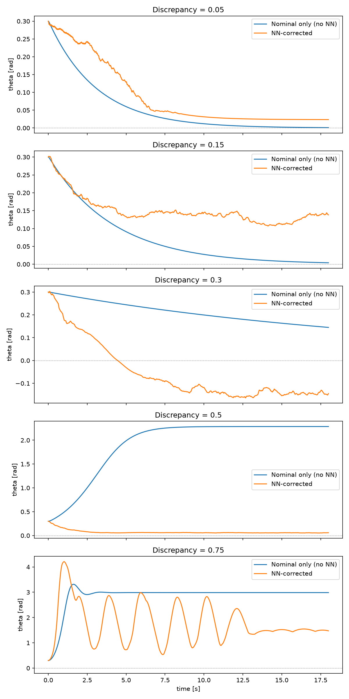

# Residual Learning for Robust MPC Under Model Discrepancy
 
An empirical study of when a neural-network correction improves a robust Model Predictive Controller (MPC) whose internal model is wrong, using an inverted pendulum as the test system.
 
**Author:** Markos Hajivassiliou
**Supervisor:** Dr Mona Faraji Niri, University of Warwick
**Full report:** [Residual_Learning_Robust_MPC_Report.pdf](report/Residual_Learning_Robust_MPC_Report.pdf)
 
## Summary
 
MPC needs an accurate model of the system it controls, but real systems are often hard to model exactly. This project asks: if a robust MPC is built around a deliberately wrong model, does a neural network that learns the model's error (residual learning) actually help, and over what range of error?
 
The pendulum length in the controller's model was underestimated by 5%, 15%, 30%, 50% and 75%. At each level, three controllers were compared against the true pendulum:
 
1. a plain MPC using the wrong model
2. a robust (multi-stage) MPC using the wrong model
3. the robust MPC with a neural-network residual correction
## Key finding
 
The benefit of residual learning is not uniform:
 
- **5-15% error:** no benefit, and a small cost. There is little error to correct, and the network adds a little noise.
- **30-50% error:** clear benefit. At 50%, the uncorrected controllers diverge to the wrong equilibrium (θ ≈ 2.28 rad), while the corrected controller converges to the upright position (θ ≈ 0.06 rad).
- **75% error:** partial benefit only. The corrected controller does not reach upright, but it settles at an intermediate angle instead of the downward equilibrium.
The network's own validation error rises sharply between 50% and 75%, which matches the point where the closed-loop benefit drops off.
 
A supplementary check showed that the robustness margin used (±5% on the length) had negligible effect compared with the residual correction. A wider margin (±30%) did change behaviour, so the mechanism works. The chosen margin was small relative to the errors tested.
 

 
## Repository structure
 
| File / folder | Purpose |
|---|---|
| `Dynamics.py` | Nonlinear pendulum dynamics (CasADi), RK4 discretisation |
| `nominal_mpc.py` | Baseline MPC using the true dynamics |
| `Data_generation.py` | Randomised-excitation trajectories used as training data |
| `residual_dynamics.py` | Builds the wrong nominal models and computes residuals |
| `residual_nn.py` | Trains one residual network per discrepancy level |
| `terminal_ingredients.py` | Linearisation, Riccati cost and gain, uncertainty bound, feasibility check |
| `robust_mpc.py` | Robust multi-stage MPC, with and without the NN correction |
| `plain_mpc_sweep.py` | Plain (single-scenario) MPC baseline |
| `plot_results.py`, `phase_portait.py`, `plot_pendulum_diagram.py` | Figure scripts |
| `data/` | Generated datasets and residuals |
| `models/` | Trained network weights |
| `results/` | Saved trajectories and figures |
| `report/` | Final report (PDF) |
 
## Setup
 
Requires Python 3.10 or later.
 
```bash
python -m venv venv
venv\Scripts\activate        # Windows
# source venv/bin/activate   # macOS / Linux
pip install -r requirements.txt
```
 
`do-mpc` prints warnings about optional ONNX and OPC UA features on import. They are harmless.
 
## Running the pipeline
 
The saved data, trained models and closed-loop results are already included, so you can regenerate the figures without rerunning any simulations. To reproduce everything from scratch, run the scripts in this order:
 
```bash
python Data_generation.py        # creates data/pendulum_dataset.npz
python residual_dynamics.py      # creates data/residuals.npz
python residual_nn.py            # trains networks, saves to models/
python terminal_ingredients.py   # Riccati terms, uncertainty bound, feasibility check
python robust_mpc.py             # closed-loop sweep (slow, see note)
python plain_mpc_sweep.py        # plain MPC baseline
python plot_results.py           # comparison figures
```
 
**Note:** the closed-loop sweep in `robust_mpc.py` simulates 18 seconds per run and includes runs with the neural network embedded in the optimiser. These are slow, and the full sweep took several hours. Create a `results/` folder before running if it does not exist.
 
## Limitations
 
This is an empirical study, not a new stability proof. It adopts the Learning-Based MPC framework of Aswani et al. (2013) and makes several simplifications, all stated in the report:
 
- the terminal set size was chosen conservatively, not derived
- the uncertainty bound was estimated from data near the equilibrium
- a simplified feasibility check replaces the full invariant-set construction, so closed-loop simulation is the main evidence of stability
- all results use a single initial condition (θ = 0.3 rad) on one simple system
## Tools
 
Python, CasADi, do-mpc, PyTorch, NumPy, Matplotlib. Report typeset in LaTeX.
